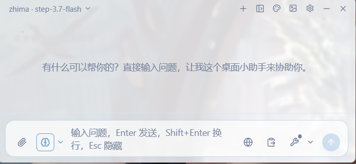
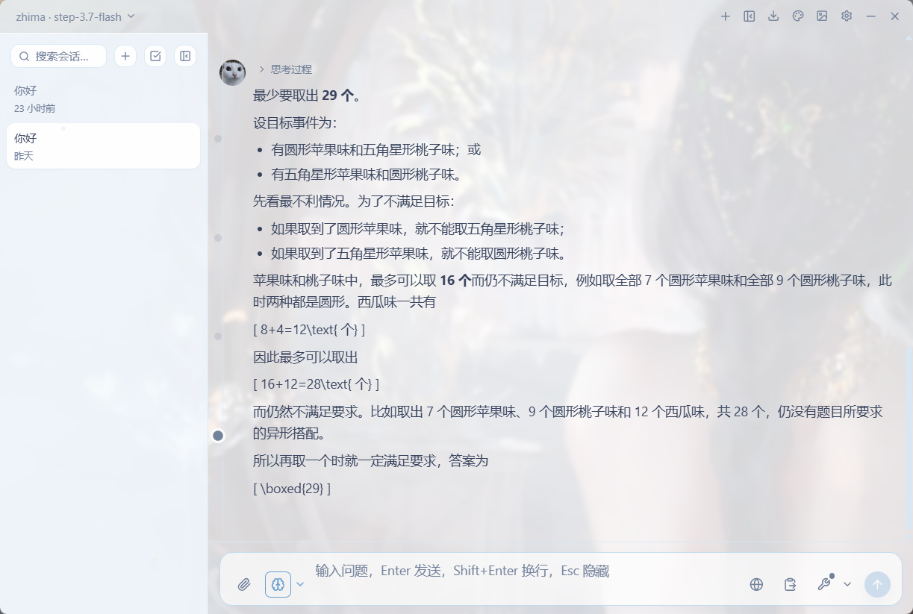
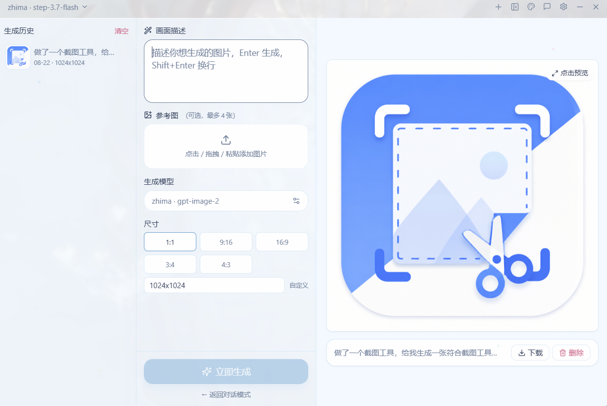
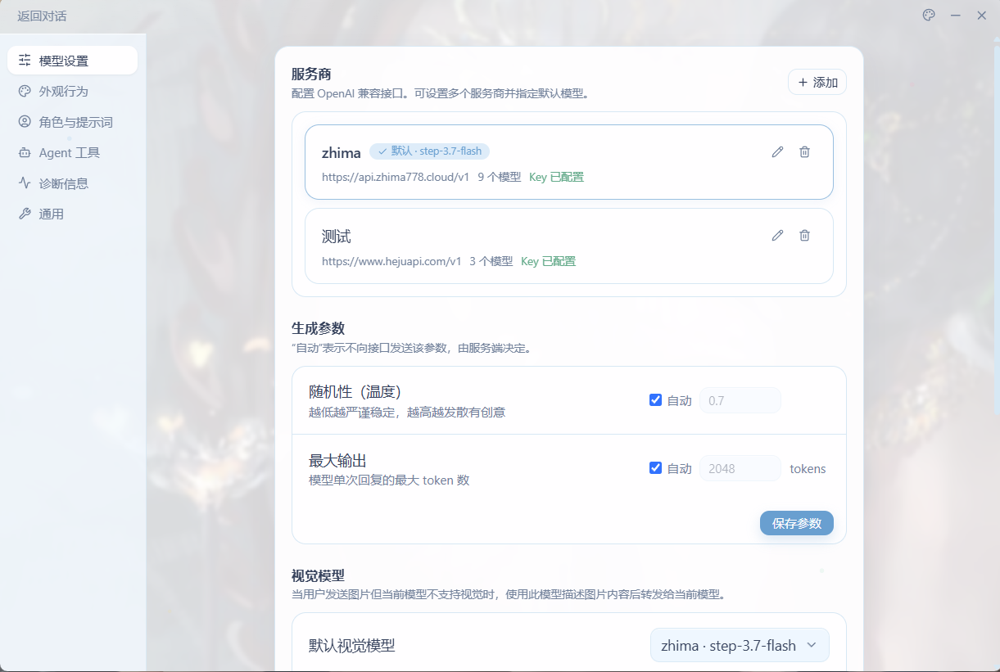
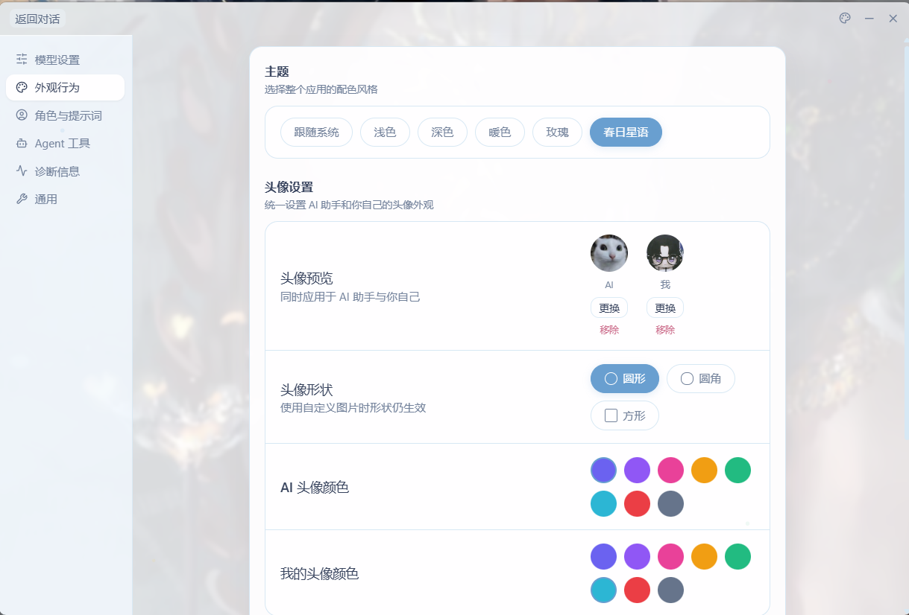
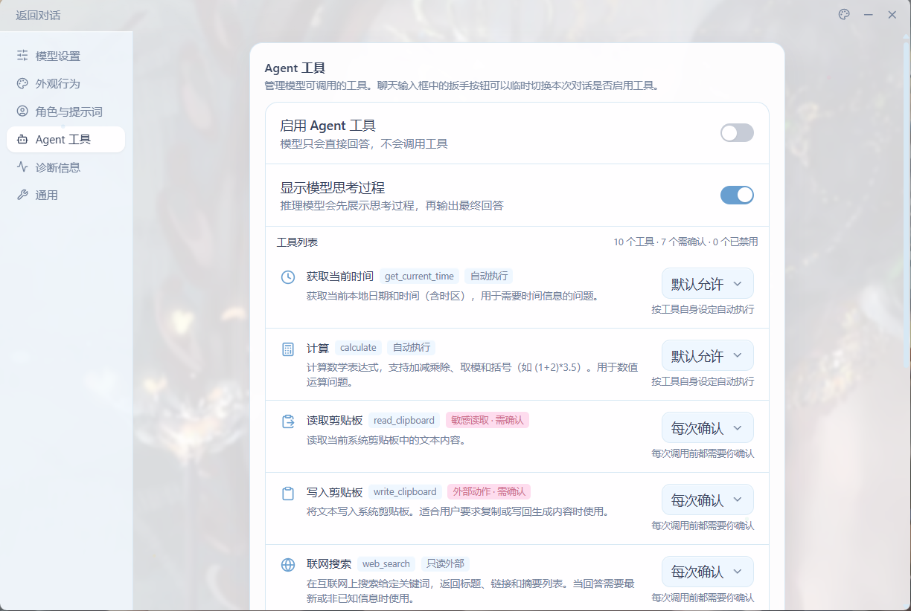
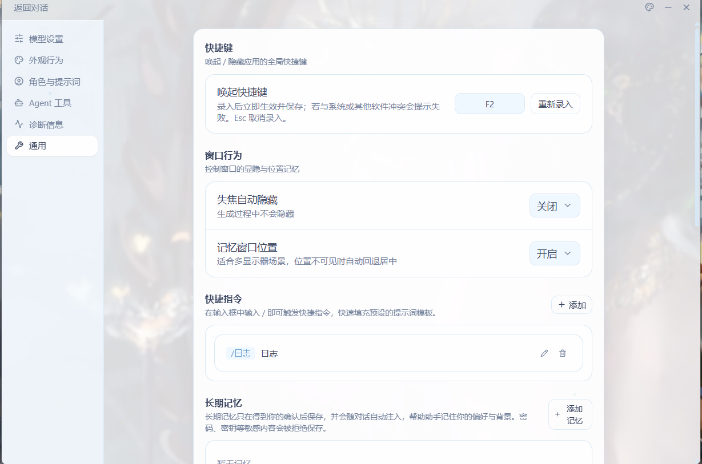

# Zhima · 芝麻 — 极致轻量的桌面悬浮窗 AI 小助手

面向 Windows 的**极致轻量**桌面 AI 小助手：按 `Alt+Space` 唤出一个悬浮窗，输入问题即可获得流式回答，**不打断当前工作流**。内置 Agent 工具、长期记忆、会话历史、文生图，数据全部保存在本地。

> 已实现完整会话历史、Agent 工具系统、自动更新、生图工作台。当前版本 **v2.1.6**。

## 🪶 极致轻量，体现在每一处

| 维度 | 芝麻 | 说明 |
|---|---|---|
| 安装包 | **约 4 MB** | 基于 Tauri 2 + 系统 WebView2，**不打包 Chromium**，远小于 Electron 方案（通常 100 MB+） |
| 界面占位 | **560 × 260** | 悬浮窗小巧，贴边悬浮不遮挡工作区；需要时再展开完整会话模式 |
| 使用方式 | **随唤随到** | `Alt+Space` 唤起即输入，答完即走，无需打开浏览器或大型客户端 |
| 后台驻留 | **单实例托盘** | 常驻系统托盘，重复启动自动聚焦，不重复占用资源 |
| 依赖 | **无账号、无云端** | 本地 SQLite 存储，API Key 存 Windows 凭据管理器，不依赖任何中介服务 |
| 运行时 | **Rust 后端** | 网络请求、SSE 解析、工具执行在 Rust 侧完成，内存占用低、响应快 |

## ✨ 核心特性

- **随叫随到**：`Alt+Space` 全局唤起 / 隐藏，悬浮窗不遮挡工作区，失焦自动隐藏（可在设置中关闭）
- **多服务商多模型**：添加任意 OpenAI 兼容接口（DeepSeek / OpenAI / 通义 / Ollama…），API Key 存入 Windows 凭据管理器，不落盘
- **流式对话**：Rust `reqwest` 直连 + 健壮 SSE 解析（粘包 / 拆包 / UTF-8 跨块），支持思考过程展示与等级选择
- **Agent 工具系统**：10 个内置工具（联网搜索 / 剪贴板 / 文件 / PDF / 截图 / 网页抓取 / 计算…），敏感工具执行前需确认，工具调用时间线可视化
- **长期记忆**：用户确认式保存，按使用频率注入，密码等敏感内容自动拒绝保存
- **会话历史**：SQLite 本地持久化，搜索 / 重命名 / 批量删除 / 轮次索引快速跳转
- **文生图工作台**：文生图 + 参考图生图，参数面板 + 画布 + 生成历史
- **多主题**：系统 / 浅色 / 深色 / 暖色 / 玫瑰 / 春日
- **自动更新**：内置自动更新，发现新版本一键下载静默安装（Ed25519 签名校验）
- **安全设计**：Prompt 分层防注入、网页抓取防 SSRF、敏感工具结果不落盘、请求限流与重试

## 🛠 技术栈

| 层 | 技术 |
|---|---|
| 前端 | React 18 · TypeScript · Vite · Tailwind CSS · Zustand · react-virtuoso |
| 后端 | Rust · Tauri 2 · reqwest · rusqlite (SQLite) · keyring (Windows 凭据) |
| 动画 | react-spring（窗口"水浮现"入场 / 页面切换过渡） |

## 📁 目录结构

```text
src/                     React + TypeScript 前端
  app/                   入口组件
  components/            composer / conversation / history / markdown / model-picker / window-shell
  features/settings/     设置面板（模型 / 外观 / 角色 / 工具 / 诊断 / 通用）
  features/imagegen/     文生图工作台
  stores/                Zustand：chat / providers / settings / window / imagegen
  services/              流式事件桥接、providers / history / memory / diagnostics API
  styles/                设计令牌与全局样式
src-tauri/src/           Rust / Tauri 后端
  agent/                 上下文预算 / 滚动摘要 / 长期记忆
  api/                   OpenAI 适配器 + SSE 解析器 + 网页搜索
  commands/              chat / providers / history / settings / memory / diagnostics 命令
  storage/               providers.json 配置 + keyring 密钥 + SQLite 会话库
  tools/                 工具注册表 + 内置工具 + SafeHttpFetcher
  window/                窗口管理 / 快捷键 / 托盘
  models/                请求 / 响应 / 配置数据结构
```

## 🚀 开发

前置：Node.js ≥ 18、Rust（stable-msvc）、Windows MSVC 构建工具。

```bash
npm install
npm run tauri:dev
```

## 📦 构建 Windows 安装包

```bash
npm run tauri:build
```

产物（NSIS 安装版 `.exe`）输出到 `src-tauri/target/release/bundle/nsis/`。打包工具（NSIS）通过 `bundle.useLocalToolsDir` 存放在项目 `target/tools/` 内。

## 🧪 测试

```bash
npm run typecheck                 # TypeScript 类型检查
npm test                          # 前端测试（Vitest + RTL）
cd src-tauri && cargo test        # Rust 单元测试
```

## 🔒 隐私

所有对话历史、记忆、生成图片均保存在本地 SQLite 数据库；API Key 存储在 Windows 凭据管理器；敏感工具结果（剪贴板 / 文件 / PDF / 截图）默认不写入历史。

## ⚠️ 已知限制

- 安装包未代码签名（未购置证书），首次运行可能触发 SmartScreen 提示
- 长期记忆为本地结构化检索，尚未引入向量检索

## 📸 界面预览














