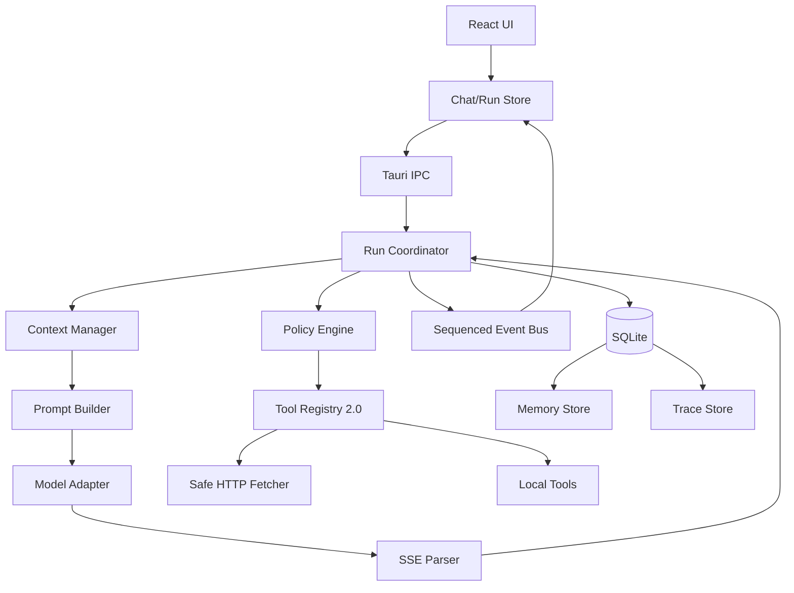

# ChatFloat v2.0.0 完整推进计划

> 基线：v1.6.0｜主题：可信、可控、可记忆的轻量个人 Agent  
> 平台：Windows 10/11｜建议周期：8 周开发 + 2 周灰度发布

---

## 1. 版本定位

v1.6.0 已具备流式问答、多服务商、多模型、视觉、文生图、联网搜索、10 个工具、工具审批、本地历史和桌面悬浮体验。当前 Agent 仍属于“固定消息窗口 + 模型自动选工具 + 工具结果回填”。

v2.0.0 不以继续堆叠工具为目标，而是升级 Agent 内核：

1. **可靠**：流式、取消、重试、审批和工具循环都有确定状态，不丢事件、不重复消息、不永久卡住。
2. **可控**：用户能看到 Agent 使用什么数据、准备发送到哪里，并可拒绝。
3. **有记忆**：支持会话摘要和用户确认式长期记忆，不静默收集隐私。
4. **有预算**：按 token、字节、工具次数和耗时控制执行。
5. **可诊断**：具备本地脱敏 trace、稳定错误码和性能指标。
6. **仍然轻量**：保持单 Agent、本地优先、低后台占用，不引入重量级编排框架。

### 1.1 成功指标

| 指标 | 目标 |
|---|---:|
| 流式首段事件丢失 | 0 |
| 请求结束后残留运行态 | 0 |
| 重试产生重复用户消息 | 0 |
| 未确认的本地敏感数据联网外发 | 0 |
| 工具失控循环 | 0 |
| 上下文超预算直接失败 | < 0.5% |
| 冷启动回退 | 不超过 v1.6.0 的 15% |
| 空闲状态 | 无轮询和持续网络请求 |
| 自动化测试 | 前端、Rust 全绿 |
| 覆盖升级 | 配置、凭据、历史无丢失 |

### 1.2 非目标

v2.0.0 不包含：多 Agent、复杂 DAG、云同步、账号系统、插件市场、任意 Shell、自动鼠标键盘、后台自主任务、大型向量知识库、语音通话。相关能力放在 v2.1+ 单独设计安全边界。

---

## 2. 产品原则与场景

### 2.1 原则

- 默认最小权限；本地敏感数据不因“允许读取”而自动获得“允许上传”。
- 高风险动作先显示对象、目的、数据范围和目标域名。
- 普通问答保持简单，不强制进入复杂计划模式。
- 记忆可见、可改、可删、可关闭。
- 不展示或依赖模型私有思维链，只展示行动摘要和可验证证据。
- 历史、记忆和诊断数据本地保存。
- 每个运行都必须进入 completed、cancelled、failed 或 budget_exceeded 终态。

### 2.2 核心场景

1. 快捷键唤醒后快速问答，不加载无关历史与记忆。
2. 读取文件、剪贴板或屏幕时展示审批；联网使用这些内容时二次审批。
3. 长对话接近模型窗口时自动生成滚动摘要，保留最近完整轮次。
4. 用户说“记住我偏好简洁回答”时展示记忆候选，确认后保存。
5. 模型、网络或工具失败时，可原配置重试、换模型重试或关闭工具重试。

---

## 3. 核心功能范围

## 3.1 AgentRun 状态机

新增统一 `AgentRun`：

```text
created -> preparing -> requesting -> streaming
        -> awaiting_approval -> running_tool -> requesting
        -> completed | cancelled | failed | budget_exceeded
```

要求：

- 前端预生成并登记 `runId`，或采用后端 ready 握手，消除首事件竞态。
- 每个事件包含 `runId`、`sequence`、`timestamp`、`type`。
- 前端按 sequence 去重，记录事件缺口。
- Error 是终止事件，不能继续读取流或执行工具。
- Finish、Error、Cancel 幂等，只产生一个最终状态。
- 审批默认 60 秒超时，超时按拒绝处理。
- 同一会话默认只允许一个活跃 run。
- 应用启动时将中断 run 标记为 failed/interrupted。

## 3.2 上下文预算管理

在 Rust 请求边界新增 `ContextManager`，替代前端固定截取 40 条消息。

预算维度：

- 最大输入 token 和请求字节；
- 模型输出预留 token；
- 单条消息、单个工具结果上限；
- 图片数量、单图大小和 Base64 总大小；
- 单 run 工具结果总大小。

保留优先级：

1. 内置安全策略；
2. 当前用户请求；
3. 当前任务必需工具结果；
4. 最近完整轮次；
5. 会话滚动摘要；
6. 相关长期记忆；
7. 更早历史。

所有文本使用安全 UTF-8 边界截断，结果附带 `truncated` 元数据。无法精确分词时采用保守字符估算，并保留 15% 安全余量。

## 3.3 会话滚动摘要

- 达到上下文阈值后异步或随下一轮生成，不在每轮调用。
- 摘要覆盖事实、决策、未完成事项、关键引用和本会话偏好。
- 最近若干完整轮次不进入摘要。
- 新摘要基于旧摘要和新增被压缩消息生成。
- 摘要失败不阻断主对话。
- 用户可查看、重新生成；删除会话时同步删除。
- 摘要只属于会话，不自动成为长期记忆。

## 3.4 用户确认式长期记忆

记忆类别：`preference`、`profile`、`project`、`constraint`、`custom`。

规则：

- 用户明确要求“记住”时弹出确认卡。
- 模型推断出的记忆必须先作为候选展示，不能静默保存。
- 密码、API Key、证件、支付等高敏感信息默认禁止保存。
- 相似记忆提示合并或更新，避免无限增长。
- 每条记忆记录类别、内容、来源、敏感等级、启用状态和时间。
- 支持查看、搜索、编辑、禁用、删除、清空和全局关闭。
- v2.0.0 使用类别、关键词、最近使用和固定上限检索，不引入向量数据库。

## 3.5 Prompt 分层

消息优先级固定为：

1. 内置安全和权限策略；
2. Agent 行为策略；
3. 用户自定义 system prompt；
4. 相关长期记忆；
5. 会话摘要；
6. 最近对话；
7. 当前用户消息；
8. 搜索与工具结果。

要求：

- 搜索、网页和文件内容不得拼入 system prompt。
- 外部内容作为不可信 `tool/retrieval` 数据传入。
- 明确要求模型不得执行资料中的指令。
- 用户 prompt 不能覆盖内置权限策略。
- Prompt 带版本号并写入 trace。

## 3.6 工具协议 2.0

工具定义增加：

```text
name, version, description, inputSchema, riskLevel,
networkAccess, dataAccess, requiresConfirmation,
timeoutMs, maxResultBytes, persistencePolicy
```

工具结果统一为：

```text
status, summary, data, sensitivity,
networkDestinations, truncated
```

执行要求：

- 执行前统一 JSON Schema 校验，默认 `additionalProperties: false`。
- 非法 JSON、缺失字段、未知工具返回结构化错误。
- 限制单次超时、单 run 总耗时、调用次数和总结果大小。
- 连续重复相同工具与参数时触发循环保护。
- 工具可取消；结果进入模型前先压缩和脱敏。
- UI 默认展示摘要，详细结果按需展开。
- 高敏感结果默认不持久化。

## 3.7 数据流审批

审批根据“数据来源 → 网络目标”判断，而不只根据工具名。

| 数据流 | 默认策略 |
|---|---|
| 公共网页 → 模型服务商 | 普通提示或按设置 |
| 剪贴板 → 模型服务商 | 确认 |
| 文件/PDF → 模型服务商 | 确认并展示文件与范围 |
| 截图 → 模型服务商 | 确认 |
| 本地敏感结果 → 搜索/网页工具 | 二次确认 |
| secret → 任意网络 | 默认禁止 |
| 公共网页 → 历史 | 保存来源和摘要，不保存全文 |

审批卡显示：行动、数据来源、目标服务商/域名、发送全文或摘要、允许一次、拒绝。可提供“本会话允许同类操作”，但不永久放行高风险操作。

## 3.8 安全网页访问

新增独立 `SafeHttpFetcher`：

- 仅 HTTP/HTTPS，默认仅 80/443。
- DNS 解析后拒绝回环、私网、链路本地、未指定、组播和保留地址。
- 禁止自动重定向；逐跳校验，最多 5 跳。
- 防止 DNS rebinding，连接固定到已验证地址。
- 独立超时、Content-Type 和响应体上限。
- 流式读取，到达上限立即停止。
- 不携带服务商 Authorization、Cookie 或共享 Header。
- trace 只记录脱敏域名和结果状态。

## 3.9 重试与恢复

每个用户轮次保存不可变 `RequestSnapshot`：服务商、模型、生成参数、工具/搜索开关、附件引用、Prompt 版本、摘要和记忆版本。

- 重试复用原用户轮次，不新增重复消息。
- 支持原配置、换模型、关闭工具三种重试。
- 自动重试只覆盖连接失败、超时、429 和部分 5xx。
- 最多 2 次，指数退避 + 抖动，尊重 `Retry-After`。
- 正文已输出后默认不自动重试。
- 非幂等工具不自动重试。

## 3.10 本地 Trace 与诊断

记录：run ID、状态时间、模型、Prompt 版本、首 token 延迟、总耗时、上下文大小、token、工具耗时/状态/字节、审批和错误码。

默认不记录：API Key、Authorization、完整敏感文件、截图 Base64、完整对话正文。

提供：

- 复制脱敏诊断信息；
- 导出诊断包前展示内容清单；
- 默认保留 14 天或最近 500 个 run；
- 设置中关闭、清空和修改保留期。

## 3.11 UI 与设置

新增设置：

- **Agent**：工具默认开关、最大步骤、审批策略、步骤详情。
- **记忆**：总开关、记忆 CRUD、会话摘要查看与重建。
- **隐私与诊断**：敏感结果保存、trace、保留期、导出与清除。

对话界面新增：

- 准备、请求模型、等待批准、执行工具、整理结果的简洁步骤条；
- 数据流审批卡；
- 摘要/截断提示；
- “本回答使用了记忆”标识；
- 记忆候选确认卡；
- 错误卡中的原配置重试、换模型和关闭工具重试。

---

## 4. 技术架构



### 4.1 Rust 模块建议

```text
src-tauri/src/
  agent/
    run.rs             状态机
    coordinator.rs     模型轮次、工具轮次、取消和终止
    context.rs         token/字节预算
    prompt.rs          Prompt 分层
    policy.rs          数据流与审批策略
    retry.rs
    events.rs
  memory/
    summary.rs
    store.rs
    retrieval.rs
  tools/
    registry.rs
    validation.rs
    safe_http.rs
  trace/
    store.rs
    export.rs
  api/
    adapter.rs
    openai_chat.rs
```

不一次性重写大型 `chat.rs`；先建立 coordinator 和兼容层，再按功能迁移。

### 4.2 前端模块建议

```text
src/features/
  agent-run/
    run-store.ts
    run-events.ts
    RunStatus.tsx
    ApprovalCard.tsx
    ToolStep.tsx
  memory/
    memory-api.ts
    memory-store.ts
    MemorySettings.tsx
    MemoryCandidate.tsx
  diagnostics/
    diagnostics-api.ts
    DiagnosticsSettings.tsx
```

`chat-store.ts` 最终只负责会话视图和发送入口，运行状态、持久化和审批逐步拆出。设置页按模块拆分，避免继续扩大单文件。

### 4.3 模型适配层

定义 `ModelAdapter`：`capabilities`、`buildRequest`、`stream`、`normalizeEvent`、`estimateTokens`。

模型元数据增加：context window、max output、tools、vision、stream usage、token 估算策略。v2.0.0 保持 Chat Completions 正式支持，为 Responses API 预留接口但不作为发布阻塞项。

---

## 5. 数据模型与迁移

新增表：

### `agent_runs`

`id`、`conversation_id`、`user_message_id`、`assistant_message_id`、`status`、`provider_id`、`model_key`、`request_snapshot_json`、`prompt_version`、`started_at`、`finished_at`、`error_code`。

### `conversation_summaries`

`conversation_id`、`summary`、`covered_until_message_id`、`source_message_count`、`model_key`、`version`、`updated_at`。

### `memories`

`id`、`category`、`content`、`keywords_json`、`sensitivity`、`source_conversation_id`、`source_message_id`、`enabled`、`created_at`、`updated_at`、`last_used_at`、`use_count`。

### `agent_trace_events`

`id`、`run_id`、`sequence`、`event_type`、`metadata_json`、`created_at`。

迁移要求：

- 通过新的 `PRAGMA user_version` 事务迁移，幂等、失败回滚。
- v1.x 会话、配置和凭据原样保留。
- 旧会话按需生成摘要，不批量调用模型。
- 旧 `tool_calls` 不自动转换为 trace。
- 首次升级提示：v1.6.0 历史可能保存完整工具结果，允许用户清理。
- 敏感工具结果、网页全文、截图和 Base64 在 v2.0.0 默认不落盘。

---

## 6. 里程碑计划

## 阶段 0：基线修复（第 1 周）

任务：

- 修复前端 Vitest 初始化失败。
- 补充发送、流式、取消、重试和审批基线测试。
- 修复重试重复消息与选项丢失。
- 修复 UTF-8 截断 panic。
- 修复流内 Error 未终止循环。
- 审批增加 60 秒超时和资源清理。
- 记录 v1.6.0 冷启动、热唤醒、首 token、内存基线。

验收：

- `npm run typecheck`、`npm test`、`cargo test` 全绿。
- 中文大结果截断不 panic。
- Error 后不再执行工具或产生正文事件。
- 重试不重复用户消息。
- 审批超时后无残留 sender。

## 阶段 1：AgentRun 与事件协议（第 2 周）

任务：状态机、run ID 预登记/握手、sequence 事件、幂等终止、run 持久化、中断恢复和单会话并发限制。

验收：

- 高频模拟下首 token 不丢。
- 重复事件不重复正文或工具卡。
- 正常、取消、失败都只有一个终态。
- 异常退出重启后旧 run 标记为 interrupted。

## 阶段 2：工具与安全边界（第 3 周）

任务：工具协议 2.0、Schema 校验、预算与循环保护、数据敏感标签、审批策略、SafeHttpFetcher、敏感结果持久化策略。

验收：

- 非法参数不会进入工具实现。
- DNS/重定向到私网、localhost、云元数据均被阻止。
- 本地敏感数据转向联网工具必须二次审批。
- 截图、文件全文和剪贴板敏感内容默认不落盘。

## 阶段 3：上下文预算与摘要（第 4 周）

任务：模型能力元数据、token/字节预算、工具结果压缩、安全截断、滚动摘要、摘要 UI。

验收：

- 大文件、大 PDF、多图片不会构造无界请求。
- 超预算时按优先级压缩并给出提示。
- 最近对话和当前问题不会被误裁剪。
- 摘要生成失败不影响对话。

## 阶段 4：长期记忆（第 5 周）

任务：记忆表、CRUD、候选确认、结构化检索、Prompt 注入、敏感内容拦截、记忆设置页。

验收：

- 未确认记忆不会写入。
- 禁用/删除后立即停止使用。
- UI 能说明本回答使用了哪些记忆。
- 高敏感内容默认无法保存。
- 普通问答只加载少量相关记忆。

## 阶段 5：Prompt、重试与 Trace（第 6 周）

任务：Prompt 分层与版本、搜索结果降权、RequestSnapshot、自动退避、诊断 trace、导出与清理。

验收：

- 网页指令不能覆盖系统安全策略。
- 重试可复现原请求配置。
- 429 尊重 `Retry-After`。
- trace 不包含密钥和默认完整敏感正文。
- 用户可关闭和清空 trace。

## 阶段 6：UI 整合与性能（第 7 周）

任务：步骤条、审批卡、记忆候选、错误恢复、设置拆分、长列表性能、键盘与无障碍、多显示器/DPI 回归。

验收：

- 普通问答界面不因 Agent 功能变复杂。
- 所有审批可纯键盘完成。
- 焦点、屏幕阅读标签、对比度合格。
- 冷启动与热唤醒回退不超过 15%。
- 空闲无轮询和持续动画。

## 阶段 7：测试、文档与 RC（第 8 周）

任务：单元/集成/E2E、安全测试、迁移演练、隐私文档、发布文档、RC 安装包和手工测试矩阵。

验收：

- 自动化测试全部通过。
- Windows 10/11 干净安装和 v1.6.0 覆盖升级通过。
- 断网、429、流中断、审批超时、取消、崩溃恢复均通过。
- 数据库迁移失败可回滚且不破坏旧数据。
- 无开发密钥、调试 URL 和 release sourcemap。

## 阶段 8：灰度与正式发布（第 9–10 周）

- `2.0.0-beta.1`：内部使用，重点看崩溃和运行状态。
- `2.0.0-beta.2`：小范围用户，重点看记忆误命中和审批体验。
- `2.0.0-rc.1`：功能冻结，只修阻塞问题。
- `2.0.0`：完成发布门槛后正式发布。

阻塞级问题：数据丢失、敏感数据越权外发、应用崩溃、run 永久卡住、无法覆盖升级。发现任何一项必须停止发布。

---

## 7. 工作包清单

### P0 必须完成

- [ ] 修复前端测试基线。
- [ ] AgentRun 状态机与 sequence 事件。
- [ ] 流错误终止、事件竞态、UTF-8 panic、重试语义。
- [ ] 审批超时和取消清理。
- [ ] 数据流二次审批。
- [ ] SafeHttpFetcher。
- [ ] 上下文 token/字节预算。
- [ ] 敏感工具结果默认不持久化。
- [ ] 数据库迁移和覆盖升级。

### P1 版本核心

- [ ] 会话滚动摘要。
- [ ] 用户确认式长期记忆。
- [ ] Prompt 分层和版本。
- [ ] 工具 Schema 校验、预算与循环保护。
- [ ] RequestSnapshot 与可靠重试。
- [ ] 本地脱敏 trace。
- [ ] Agent、记忆、隐私设置 UI。

### P2 可延期到 v2.0.1

- [ ] 更丰富的 trace 可视化。
- [ ] 更多模型 tokenizer。
- [ ] Responses API 正式适配。
- [ ] 记忆导入导出。
- [ ] 高级工具权限模板。

P0 未完成不得发布；P1 若延期必须明确降级范围，不允许用临时绕过替代安全设计。

---

## 8. 测试策略

### 8.1 Rust 单元测试

覆盖状态转换、事件序号、SSE 错误、UTF-8 截断、预算裁剪、摘要边界、记忆筛选、Schema 校验、审批超时、重试退避、trace 脱敏、数据库迁移和 SafeHttpFetcher 地址判定。

### 8.2 前端单元与组件测试

覆盖乱序/重复事件、取消与错误竞态、审批超时 UI、重试不重复消息、记忆 CRUD、记忆候选、摘要提示、步骤条、诊断清理、键盘操作和 store 恢复。

### 8.3 集成测试

使用本地 mock OpenAI 服务模拟：

- 正常 SSE 和首 chunk 立即到达；
- chunk 拆分、粘包、UTF-8 跨块；
- 中途错误对象和连接断开；
- 429 + `Retry-After`、5xx、超时；
- 多轮 tool_calls、非法参数、重复调用；
- 审批允许、拒绝、超时、取消；
- 超大上下文、图片和工具结果。

### 8.4 安全测试

- DNS 指向私网、重定向到 localhost、IPv6、IPv4-mapped IPv6。
- 网页/文件提示注入要求调用工具或泄露数据。
- 本地敏感数据经搜索词、URL、工具参数外传。
- trace、历史、日志和诊断包敏感信息扫描。
- Tauri capability 最小权限检查。
- URL、路径、图片和 IPC 请求大小边界。

### 8.5 桌面手工矩阵

Windows 10/11，100%/125%/150% DPI，单屏/多屏，冷启动、快捷键唤醒、托盘、休眠恢复、失焦隐藏、完整会话、覆盖升级、卸载后数据保留。

---

## 9. 隐私、安全与权限要求

- 更新 `docs/PRIVACY.md`，说明模型服务商、搜索、网页、工具结果、记忆和 trace 的数据流。
- 设置中提供本机数据位置和一键清除入口。
- 收窄 Tauri capabilities，移除前端不必要的通用文件写入、opener 或 event emit 权限；优先通过受控 Rust command 暴露能力。
- API Key 继续使用 Windows 凭据管理器。
- 日志和错误不得包含 Authorization、密钥或完整敏感正文。
- release 构建禁用 source map；依赖和锁文件纳入发布审核。
- 若无代码签名，继续明确 SmartScreen 风险；自动更新不得在缺少签名校验时上线。

---

## 10. 发布门槛

### 功能

- [ ] 快速问答、视觉、搜索、工具、历史和文生图无重大回归。
- [ ] 长会话可摘要并保持连续性。
- [ ] 长期记忆全流程可控。
- [ ] 重试、取消、审批和崩溃恢复可靠。

### 安全

- [ ] 无已知高危 SSRF。
- [ ] 无未经确认的敏感数据联网路径。
- [ ] 敏感工具结果默认不落盘。
- [ ] Prompt 注入测试不能越过工具和数据流策略。
- [ ] capabilities 满足最小权限。

### 质量

- [ ] TypeScript 类型检查、前端测试、Rust 测试全部通过。
- [ ] P0/P1 场景有自动化或可重复手工用例。
- [ ] 无已知崩溃、永久 loading 和数据库损坏问题。
- [ ] 性能指标达到目标。

### 发布

- [ ] `package.json`、`Cargo.toml`、`tauri.conf.json` 均为 `2.0.0`。
- [ ] v1.6.0 → v2.0.0 覆盖升级成功且数据无丢失。
- [ ] Windows 10/11 干净安装通过。
- [ ] 隐私说明、升级文档、README 和 release notes 已更新。
- [ ] 安装包 SHA-256 已生成并验证。
- [ ] 完成功能冻结后的 3 天 RC 稳定观察。

---

## 11. 风险与应对

| 风险 | 应对 |
|---|---|
| 重构 `chat.rs` 引入回归 | 建兼容层，按状态机、工具、上下文分阶段迁移 |
| 不同模型 token 计算不一致 | 保守估算 + 15% 余量 + 可配置能力元数据 |
| 摘要遗漏关键事实 | 保留最近完整轮次，摘要可查看和重建 |
| 记忆误保存或误命中 | 先确认、限制数量、展示使用来源、随时禁用 |
| 审批过多影响体验 | 低风险默认放行，本地敏感数据联网才强提醒 |
| SSRF 实现复杂 | 独立 fetcher、逐跳验证、专门安全测试 |
| Trace 泄露隐私 | 白名单字段、脱敏、短保留期、导出预览 |
| 版本范围膨胀 | P0/P1/P2 分级，新增需求默认进入 v2.1 |
| 前端测试不稳定 | 阶段 0 先修复，测试全绿作为每阶段合并门槛 |

---

## 12. 开发流程与完成定义

每个功能必须包含：

1. 用户可见行为和失败行为；
2. 数据与权限边界；
3. Rust/前端自动化测试；
4. 数据库迁移或兼容说明；
5. trace 与错误码；
6. 文档更新；
7. 无新增 lint/type 错误；
8. 可从失败状态安全恢复。

建议分支：`feature/agent-run`、`feature/context-budget`、`feature/tool-policy`、`feature/memory`、`feature/trace`。每阶段结束产出可运行版本，避免在最后一周集中集成。

---

## 13. v2.0.0 发布说明建议摘要

ChatFloat v2.0.0 将 Agent 内核全面升级：加入可靠运行状态机、上下文预算、会话摘要、用户确认式长期记忆、工具参数验证、敏感数据流审批、安全网页访问和本地脱敏诊断。版本重点不是增加更多自动操作，而是让现有能力更稳定、透明、可控，同时继续保持本地优先和轻量桌面体验。
