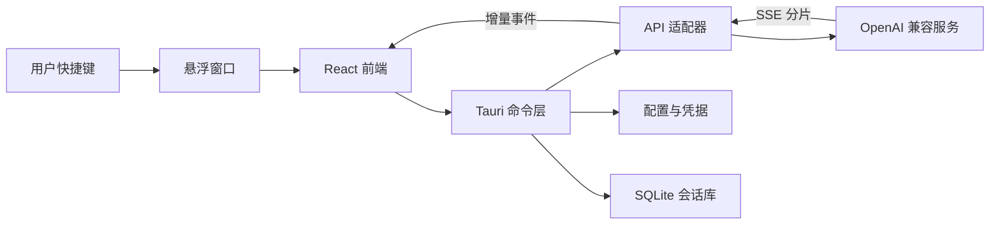

# 桌面悬浮窗 AI 聊天助手——完整开发计划

## 1. 项目定位

### 1.1 产品目标

开发一款面向 Windows 的轻量桌面 AI 助手：

- 通过全局快捷键快速唤醒；
- 在当前工作流上方弹出，不打断正在使用的软件；
- 输入问题后立即获得流式回答；
- 支持 OpenAI 兼容接口、第三方中转服务和本地模型网关；
- 支持添加多个服务商与自由切换模型；
- 默认保持简洁、漂亮、低干扰；
- 最终生成可安装或可直接运行的 Windows `.exe`。

### 1.2 核心体验指标

1. **快**：快捷键触发后窗口应尽快出现并自动聚焦输入框。
2. **轻**：空闲时尽量减少 CPU 占用，内存占用明显低于常规 Electron 聊天应用。
3. **稳**：流式响应可停止、重试；网络异常不会卡死窗口。
4. **顺手**：主要操作均可使用键盘完成。
5. **通用**：兼容标准 OpenAI API，同时允许手工填写 Base URL、API Key 和模型名。
6. **好看**：采用接近 ChatGPT 的克制、简约、留白充足的视觉风格，但不直接复制其品牌元素。

### 1.3 首版范围

首版只聚焦“快速提问与回答”，不做大而全：

- Windows 10/11；
- 全局快捷键唤醒/隐藏；
- 系统托盘常驻；
- 单窗口多轮对话；
- OpenAI 兼容的 `/v1/chat/completions` 流式协议；
- 多服务商配置；
- 模型列表拉取与手工添加模型；
- Markdown、代码块和复制；
- 本地会话历史；
- 浅色/深色/跟随系统；
- 打包为 NSIS 安装版 `.exe`，可选增加便携版。

首版暂不实现：账号系统、云同步、插件市场、联网搜索代理、复杂 Agent、语音通话、文件知识库、跨设备同步。它们可以在基础体验稳定后逐步加入。

---

## 2. 技术方案

## 2.1 推荐技术栈

| 模块 | 推荐方案 | 选择原因 |
|---|---|---|
| 桌面框架 | Tauri 2 | 安装包和运行占用通常比 Electron 更小，支持托盘、窗口、快捷键和 Windows 打包 |
| 前端 | React + TypeScript + Vite | 开发效率高、组件生态成熟、类型安全 |
| 样式 | Tailwind CSS + CSS Variables | 快速构建统一设计系统，方便主题切换 |
| 基础组件 | Radix UI（按需） | 无样式、可访问、适合定制简约界面 |
| 图标 | Lucide React | 线性图标，视觉轻量统一 |
| 状态管理 | Zustand | API 简洁，适合轻量桌面应用 |
| 本地数据库 | SQLite（Tauri SQL 插件） | 会话数据结构化、查询和迁移稳定 |
| 普通配置 | Tauri Store 或 JSON | 存模型偏好、窗口尺寸、主题等非敏感信息 |
| 密钥存储 | Windows Credential Manager / keyring | API Key 不应明文写入普通配置文件 |
| HTTP 与流式解析 | Rust `reqwest` + SSE/字节流解析 | 避免浏览器 CORS 限制，便于统一超时、取消与错误处理 |
| Markdown | `react-markdown` + `remark-gfm` | 支持常见 Markdown 与表格 |
| 代码高亮 | Shiki 或轻量 Prism 方案 | 代码展示清晰；建议按需加载降低体积 |
| 测试 | Vitest + React Testing Library + Playwright/Tauri 驱动 | 覆盖逻辑、组件和关键端到端流程 |
| 打包 | Tauri Bundler + NSIS | 输出 Windows 安装版 `.exe` |

### 2.2 为什么不优先使用 Electron

Electron 开发成熟，但会携带 Chromium，安装包、内存和后台资源占用通常更高。本项目强调“非常轻量、常驻、快速唤醒”，因此优先 Tauri。只有在团队完全没有 Rust 经验、必须依赖 Electron 专属库时才考虑 Electron。

### 2.3 兼容性边界

“OpenAI 格式”在不同服务商处并非完全一致。建议分两层处理：

1. **标准适配层**：首版完整支持 `POST /v1/chat/completions`、`stream: true` 和常见 SSE `data:` 分片。
2. **兼容扩展层**：允许配置自定义请求头、API 路径、参数开关，并预留 `/v1/responses` 适配器。

模型发现策略：

- 优先尝试 `GET /v1/models`；
- 拉取失败时允许用户手工输入模型 ID；
- 不根据模型名称硬编码能力；
- 每个模型可单独设置上下文长度、温度支持、视觉能力等可选元数据。

这样可覆盖 OpenAI、兼容中转站、Ollama/OpenAI 网关、LM Studio、vLLM、LiteLLM 等常见场景。对于不遵循标准事件格式的服务商，需要增加独立适配器，不能承诺零配置兼容所有非标准实现。

---

## 3. 产品交互设计

## 3.1 窗口的三种状态

### A. 待机态

- 默认仅驻留系统托盘；
- 可在设置中开启 48–56 px 的桌面悬浮球；
- 托盘菜单提供：打开、快速提问、新对话、设置、退出；
- 后台无请求时不执行轮询和动画。

### B. 快速提问态

- 默认快捷键建议：`Alt + Space`，若与系统/软件冲突则引导修改；
- 窗口建议宽 560 px、高 150–220 px；
- 出现在当前屏幕中心偏上位置，或记忆上次位置；
- 唤醒后自动聚焦输入框；
- `Enter` 发送，`Shift + Enter` 换行，`Esc` 隐藏；
- 顶部显示当前模型，点击可快速切换；
- 输入框支持粘贴文本，但首版不必支持附件。

### C. 回答态

- 发出问题后窗口向下平滑扩展，最大高度不超过当前工作区的 70%；
- 回答逐字流式显示；
- 流式阶段显示“停止生成”；
- 结束后提供复制、重试、继续追问和展开到完整会话；
- 用户滚动离开底部后停止自动跟随，避免抢滚动位置；
- 窗口失焦是否自动隐藏由用户设置，生成中默认不自动隐藏。

## 3.2 完整会话模式

快速窗口中点击“展开”进入完整模式：

- 左侧历史列表可折叠；
- 中间为对话区；
- 顶部为模型和新对话；
- 底部为固定输入区；
- 支持对话重命名、删除、清空；
- 首版无需复杂文件夹和标签系统。

## 3.3 设置页面

建议分为四组：

1. **服务商**
   - 名称；
   - Base URL；
   - API Key；
   - API 类型：Chat Completions / Responses（后续）；
   - 自定义请求头；
   - 连接测试；
   - 拉取模型。

2. **模型**
   - 默认模型；
   - 可用模型列表；
   - 手工添加模型 ID；
   - 温度、最大输出长度等高级参数；
   - 模型快捷收藏。

3. **外观与窗口**
   - 浅色、深色、跟随系统；
   - 字号；
   - 窗口透明度（谨慎提供，不使用模糊玻璃作为默认）；
   - 始终置顶；
   - 是否显示悬浮球；
   - 是否记忆位置和尺寸。

4. **通用**
   - 全局快捷键；
   - 开机启动；
   - 失焦隐藏；
   - 本地历史开关；
   - 清除会话和配置；
   - 应用版本和更新检查。

---

## 4. 视觉规范

## 4.1 风格关键词

- 简约、克制、安静；
- 大面积中性色；
- 清晰的字体层级；
- 圆角但不过度“卡片化”；
- 极少阴影，仅用于悬浮窗与桌面的层级区分；
- 动效短、柔和、可关闭；
- 不复制 ChatGPT 标识、图标或专有品牌素材。

## 4.2 建议设计令牌

### 浅色主题

- 页面背景：`#F7F7F8`；
- 主面板：`#FFFFFF`；
- 主文字：`#202123`；
- 次级文字：`#6B7280`；
- 边框：`#E5E7EB`；
- 主操作：`#111827`；
- 成功提示：`#16865C`；
- 错误提示：`#C2413B`。

### 深色主题

- 页面背景：`#171717`；
- 主面板：`#212121`；
- 次级面板：`#2A2A2A`；
- 主文字：`#ECECEC`；
- 次级文字：`#A3A3A3`；
- 边框：`#3A3A3A`。

### 尺寸建议

- 窗口圆角：14–18 px；
- 输入框圆角：14 px；
- 普通按钮：8–10 px；
- 基础字号：14 px；
- 正文字号：14–15 px；
- 代码字号：13 px；
- 间距基准：4 px；
- 常用间距：8 / 12 / 16 / 24 px。

## 4.3 动效规范

- 唤醒：120–180 ms 的淡入和轻微位移；
- 展开：180–240 ms，高度变化使用 ease-out；
- 模型菜单：120–160 ms；
- 流式光标仅做低频闪烁；
- 遵循系统“减少动态效果”设置；
- 禁止持续性背景动画，以免增加空闲功耗。

---

## 5. 系统架构



## 5.1 前端模块

建议目录：

```text
src/
  app/
    App.tsx
    router.tsx
  components/
    composer/
    conversation/
    markdown/
    model-picker/
    window-shell/
  features/
    chat/
    providers/
    settings/
    history/
  stores/
    chat-store.ts
    settings-store.ts
    window-store.ts
  services/
    tauri-client.ts
    stream-events.ts
  styles/
    tokens.css
    globals.css
  types/
```

职责划分：

- `chat`：消息、生成状态、停止、重试、上下文组装；
- `providers`：服务商和模型配置界面；
- `settings`：快捷键、主题、窗口行为；
- `history`：会话列表、查询、删除；
- `window-shell`：标题栏、拖动区、紧凑/展开状态。

## 5.2 Rust/Tauri 模块

```text
src-tauri/src/
  main.rs
  commands/
    chat.rs
    providers.rs
    settings.rs
    history.rs
  api/
    mod.rs
    openai_chat.rs
    openai_responses.rs
    stream_parser.rs
  window/
    manager.rs
    shortcuts.rs
    tray.rs
  storage/
    database.rs
    migrations.rs
    secrets.rs
  models/
    request.rs
    response.rs
    config.rs
  errors.rs
```

关键原则：

- API 请求由 Rust 层发起，统一处理超时、证书、代理、取消和流式解析；
- 前端只接收结构化事件，不直接保存 API Key；
- 每次生成拥有唯一 `request_id`；
- 停止生成时使用取消令牌中止网络请求；
- 所有 Tauri 命令均做输入校验，不允许前端传任意文件路径或执行命令。

## 5.3 流式响应事件

建议定义统一事件：

```ts
type ChatStreamEvent =
  | { type: "start"; requestId: string; messageId: string }
  | { type: "delta"; requestId: string; text: string }
  | { type: "reasoning_delta"; requestId: string; text: string }
  | { type: "usage"; inputTokens?: number; outputTokens?: number }
  | { type: "finish"; finishReason?: string }
  | { type: "error"; code: string; message: string; retryable: boolean };
```

流式处理要求：

- 能处理一个数据块内多个 SSE 事件；
- 能处理一个 SSE 事件被拆到多个网络数据块；
- 忽略空行和心跳；
- 正确识别 `[DONE]`；
- 对无法解析的分片记录脱敏日志，但不使整个应用崩溃；
- 前端使用批量刷新或 `requestAnimationFrame` 合并高频 token，避免每个字符都触发完整重渲染。

## 5.4 本地数据模型

### Provider

- `id`
- `name`
- `base_url`
- `api_type`
- `api_key_ref`（只保存系统凭据引用）
- `custom_headers_json`
- `created_at`
- `updated_at`

### Model

- `id`
- `provider_id`
- `model_key`
- `display_name`
- `capabilities_json`
- `is_favorite`
- `sort_order`

### Conversation

- `id`
- `title`
- `provider_id`
- `model_key`
- `system_prompt`
- `created_at`
- `updated_at`

### Message

- `id`
- `conversation_id`
- `role`
- `content`
- `status`
- `usage_json`
- `created_at`

数据库启用迁移版本，后续升级不能直接修改线上用户表结构。

---

## 6. 安全与隐私

1. API Key 使用 Windows Credential Manager 或可靠 keyring 存储；
2. 日志中禁止记录 API Key、完整 Authorization 请求头和完整私人对话；
3. 自定义 Header 的敏感值也应进入凭据库；
4. Base URL 只允许 `http`/`https`，默认警告非本机的明文 HTTP；
5. 配置导出默认不包含密钥；
6. WebView 设置严格 CSP，不加载不必要的远程脚本；
7. Markdown 禁止原始 HTML或进行严格净化，防止 XSS；
8. 外部链接点击后交给系统浏览器，并显示目标域名；
9. Tauri 权限采用最小化白名单；
10. 自动更新包必须签名；若首版不做签名更新，则先不启用静默自动更新。

隐私原则：所有会话默认只保存在本机；用户可关闭历史记录，也可一键清空。

---

## 7. 开发阶段与任务拆解

## 阶段 0：产品与技术预研

交付物：可运行的技术验证项目。

任务：

- 验证 Tauri 2 在 Windows 10/11 的构建环境；
- 验证无边框透明/圆角窗口、置顶、拖动和多屏定位；
- 验证全局快捷键注册及冲突处理；
- 验证托盘和单实例；
- 验证 Rust 请求 OpenAI 兼容接口并把 SSE 增量发送给 React；
- 测量冷启动、热唤醒、空闲内存和空闲 CPU；
- 确认目标模型服务至少覆盖一个云服务和一个本地服务。

完成标准：能用快捷键调出窗口，发送问题并看到流式文本。

## 阶段 1：工程骨架

任务：

- 初始化 Tauri 2 + React + TypeScript + Vite；
- 配置 ESLint、Prettier、TypeScript 严格模式；
- 建立前端与 Rust 目录边界；
- 建立统一错误类型和日志；
- 建立浅色/深色设计令牌；
- 配置开发、测试、生产三套构建参数；
- 添加基础 CI：类型检查、单元测试、构建检查。

完成标准：干净环境可一条命令启动开发版和构建版。

## 阶段 2：桌面壳能力

任务：

- 无边框窗口与自定义拖动区；
- 全局快捷键唤醒、再次触发隐藏；
- 自动聚焦输入框；
- 系统托盘与菜单；
- 单实例运行，重复启动时唤醒现有窗口；
- 多显示器定位和 DPI 缩放；
- 记忆窗口位置、尺寸、置顶状态；
- `Esc` 隐藏与失焦行为；
- 可选开机启动。

完成标准：窗口行为在单屏、多屏和不同缩放率下均正常。

## 阶段 3：模型服务与流式聊天

任务：

- Provider 的新增、编辑、删除和连接测试；
- API Key 安全存储；
- `/v1/models` 拉取和手工模型；
- Chat Completions 请求构建；
- SSE 解析器；
- 开始、增量、完成、错误事件；
- 请求取消；
- 超时、401、403、404、429、5xx、网络中断的可读提示；
- 模型切换；
- 多轮上下文；
- 重试与重新生成。

完成标准：至少通过 OpenAI 标准服务、一个兼容服务和一个本地 OpenAI 网关的测试。

## 阶段 4：核心界面与视觉精修

任务：

- 三态悬浮窗；
- 输入框自适应高度；
- 模型快捷选择器；
- Markdown、GFM、代码高亮；
- 代码块复制；
- 流式光标、停止按钮、加载与错误状态；
- 自动滚动规则；
- 完整会话模式；
- 历史列表和搜索；
- 设置页面；
- 浅色/深色主题；
- 键盘导航与焦点样式；
- 统一空状态、确认框、Toast。

完成标准：所有核心流程可仅使用键盘完成，界面无明显跳动和溢出。

## 阶段 5：本地存储与可靠性

任务：

- SQLite 初始化与迁移；
- 会话、消息、模型元数据持久化；
- 生成中断后的消息状态恢复；
- 历史记录关闭模式；
- 一键清空数据；
- 配置导入/导出（不含密钥）；
- 数据库异常的备份与恢复提示；
- 限制日志体积并滚动清理。

完成标准：升级应用不会丢失已有配置和会话。

## 阶段 6：测试与性能优化

### 单元测试

- SSE 分片、粘包、半包、`[DONE]`；
- API 错误映射；
- 上下文消息构建；
- Provider URL 规范化；
- 配置迁移；
- 会话标题与存储逻辑。

### 组件测试

- 输入与发送；
- 模型切换；
- 流式文本更新；
- 停止与重试；
- Markdown/代码块；
- 错误提示；
- 设置表单校验。

### 端到端测试

- 首次启动配置；
- 快捷键唤醒；
- 完成一次流式对话；
- 中途停止；
- 断网后恢复；
- 重启后读取历史；
- 多屏幕移动；
- 安装、覆盖升级、卸载。

### 性能检查

- 空闲 CPU 接近 0；
- 不使用轮询维持界面；
- 长回答时 UI 不明显卡顿；
- 代码高亮按需加载；
- 历史列表虚拟化或分页；
- 长会话避免全量重复渲染；
- 记录冷启动和快捷键热唤醒数据，作为每版回归基线。

## 阶段 7：Windows 打包与发布

任务：

- 设置应用名称、图标、版本号、发布者信息；
- 生成多尺寸 `.ico`；
- 配置 Tauri Release 构建；
- 输出 NSIS 安装版 `.exe`；
- 可选输出 MSI 与便携版；
- 处理 WebView2 Runtime 检测和安装策略；
- 安装目录、开始菜单、桌面快捷方式按需配置；
- 验证卸载时用户数据保留/删除选项；
- 使用 Windows 代码签名证书签名，减少 SmartScreen 警告；
- 生成 SHA-256 校验值；
- 在干净的 Windows 10/11 虚拟机测试安装和运行；
- 后续接入签名的增量更新机制。

建议最终产物：

```text
release/
  AI-Assistant-Setup-x.y.z.exe
  AI-Assistant-Portable-x.y.z.exe   # 可选
  checksums.txt
  release-notes.txt
```

---

## 8. API 请求示例与适配原则

标准请求：

```json
{
  "model": "your-model-id",
  "messages": [
    { "role": "system", "content": "你是一个简洁可靠的桌面助手。" },
    { "role": "user", "content": "解释一下 SSE。" }
  ],
  "stream": true,
  "temperature": 0.7
}
```

请求构造原则：

- 只发送模型明确支持的参数；
- 温度、最大 token 等参数允许设置为“自动”，自动时不发送；
- Provider 可配置额外 Header；
- Base URL 统一去除末尾重复斜杠；
- 允许 Provider 指定完整接口路径，避免服务商路径不一致；
- 对 reasoning、usage 等非统一字段，在适配层转换为内部事件；
- 未识别字段保留扩展空间，但前端不依赖原始服务商结构。

---

## 9. 错误与边界场景

必须明确处理：

- 快捷键被其他程序占用；
- 当前屏幕被拔出后窗口跑到屏幕外；
- 系统缩放从 100% 切到 150%/200%；
- API Key 无效或额度不足；
- Base URL 拼写错误；
- 服务端不支持 `/v1/models`；
- 模型不支持某个参数；
- SSE 返回 JSON 错误而不是流；
- 流式过程中断网；
- 用户连续发送或快速切换模型；
- 用户在生成中关闭/隐藏窗口；
- 超长 Markdown、超长代码块和超长单词；
- 消息中包含恶意 HTML；
- SQLite 被锁定或数据迁移失败；
- 应用崩溃重启后存在未完成消息；
- Windows 休眠恢复后连接失效。

---

## 10. 验收标准

## 10.1 功能验收

- [ ] 全局快捷键可唤醒、聚焦和隐藏窗口；
- [ ] 托盘菜单功能完整；
- [ ] 能添加任意 OpenAI 兼容 Base URL；
- [ ] API Key 不以明文存入普通配置和日志；
- [ ] 能自动拉取或手工添加模型；
- [ ] 模型可以在对话前和对话中切换；
- [ ] 回答以流式方式稳定显示；
- [ ] 可以停止、复制、重试；
- [ ] Markdown 和代码块显示正确；
- [ ] 会话可保存、读取、删除；
- [ ] 浅色、深色和跟随系统可用；
- [ ] 多屏与 DPI 缩放正常；
- [ ] 断网、鉴权失败和限流有明确提示；
- [ ] 可以输出可安装的 `.exe`。

## 10.2 体验验收

- [ ] 唤醒后无需鼠标即可提问；
- [ ] 发送后立即出现反馈；
- [ ] 流式期间窗口不卡顿；
- [ ] 回答增长不会让窗口超出屏幕；
- [ ] 操作层级少，常用功能不超过两次点击；
- [ ] 视觉风格统一，没有过多边框、阴影和颜色；
- [ ] 高对比度和键盘焦点清晰；
- [ ] 空闲时无持续网络请求和明显 CPU 占用。

## 10.3 发布验收

- [ ] Windows 10、Windows 11 干净环境安装成功；
- [ ] 覆盖升级不丢配置和历史；
- [ ] 卸载行为符合提示；
- [ ] 安装包已签名或明确说明未签名风险；
- [ ] 发布包带版本号、校验值和变更说明；
- [ ] 不包含开发密钥、调试地址和 Source Map（除非单独安全托管）。

---

## 11. 建议的版本路线

### v0.1 技术原型

快捷键、悬浮窗、单服务商、单模型、SSE 流式输出。

### v0.2 MVP

多服务商、多模型、托盘、停止/重试、Markdown、安全密钥存储、基础设置。

### v0.3 可用版

会话历史、完整会话模式、主题、多屏、DPI、错误恢复、性能优化。

### v1.0 发布版

完整测试、安装器、代码签名、升级策略、隐私说明、稳定的数据迁移。

### v1.x 可选增强

- 截图后提问；
- 剪贴板快捷解释/翻译；
- 图片输入；
- Prompt 模板；
- `/v1/responses` 完整适配；
- Ollama 原生适配；
- 语音输入；
- 可选联网搜索；
- 自动更新。

---

## 12. 实施优先级结论

最先验证的不是美术，而是四件高风险事项：

1. Tauri 悬浮窗口在多屏和 DPI 下的行为；
2. 全局快捷键与窗口焦点是否稳定；
3. Rust 到前端的 SSE 流式链路和取消机制；
4. Windows 安装包在干净设备上的可运行性。

四项验证通过后，再集中完成高质量 UI。推荐的首版组合为：

> **Tauri 2 + React + TypeScript + Rust reqwest + SQLite + Windows Credential Manager + NSIS**

这套方案最贴合“轻量、快速唤醒、流式回答、OpenAI 兼容、最终打包 EXE”的目标。